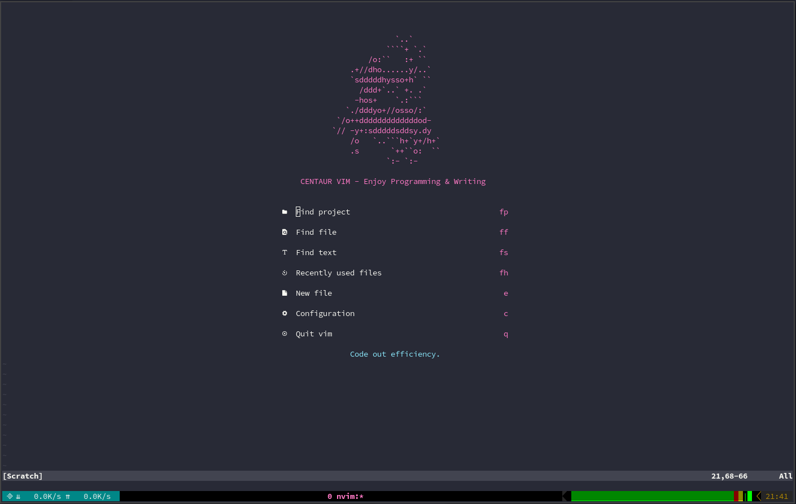
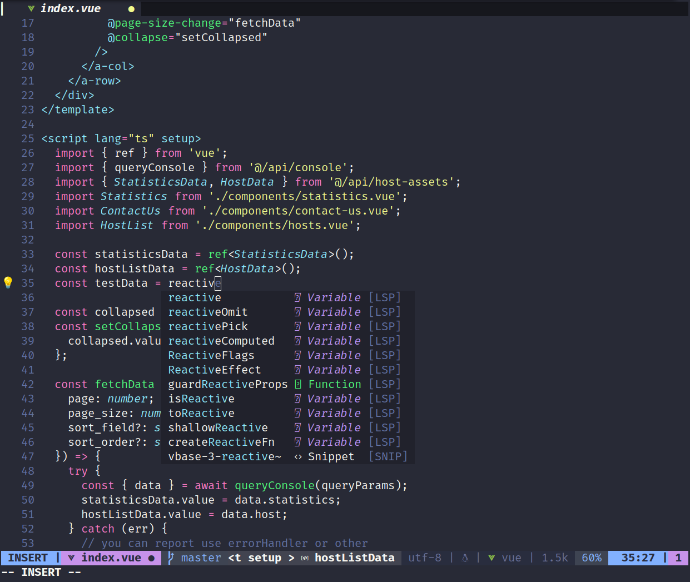
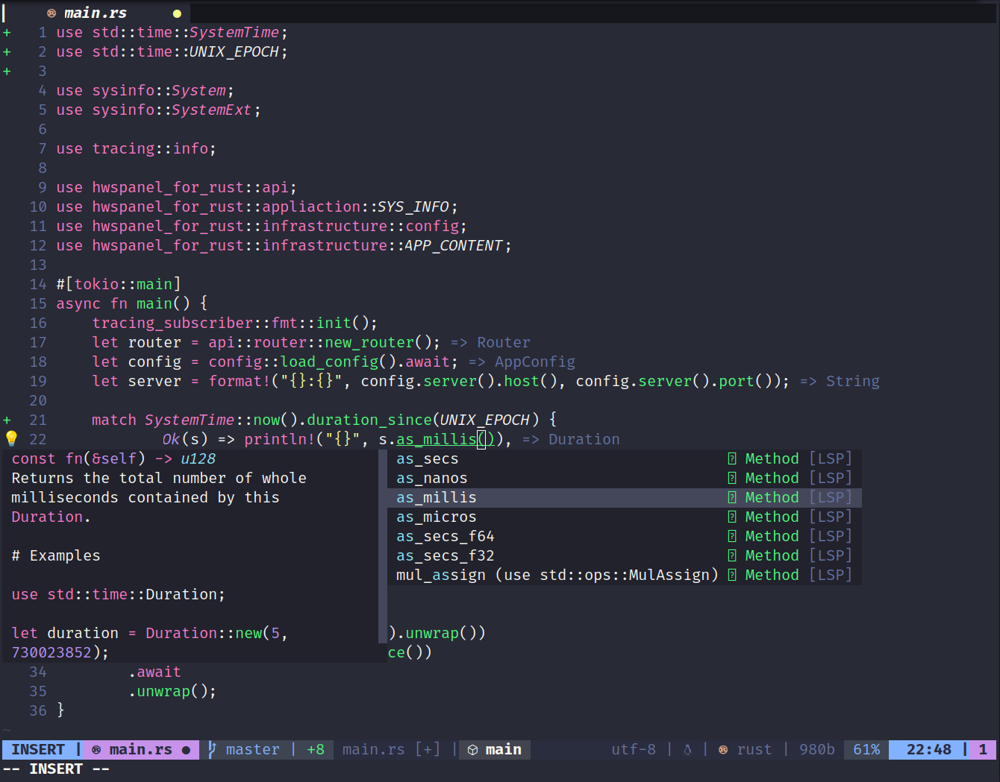
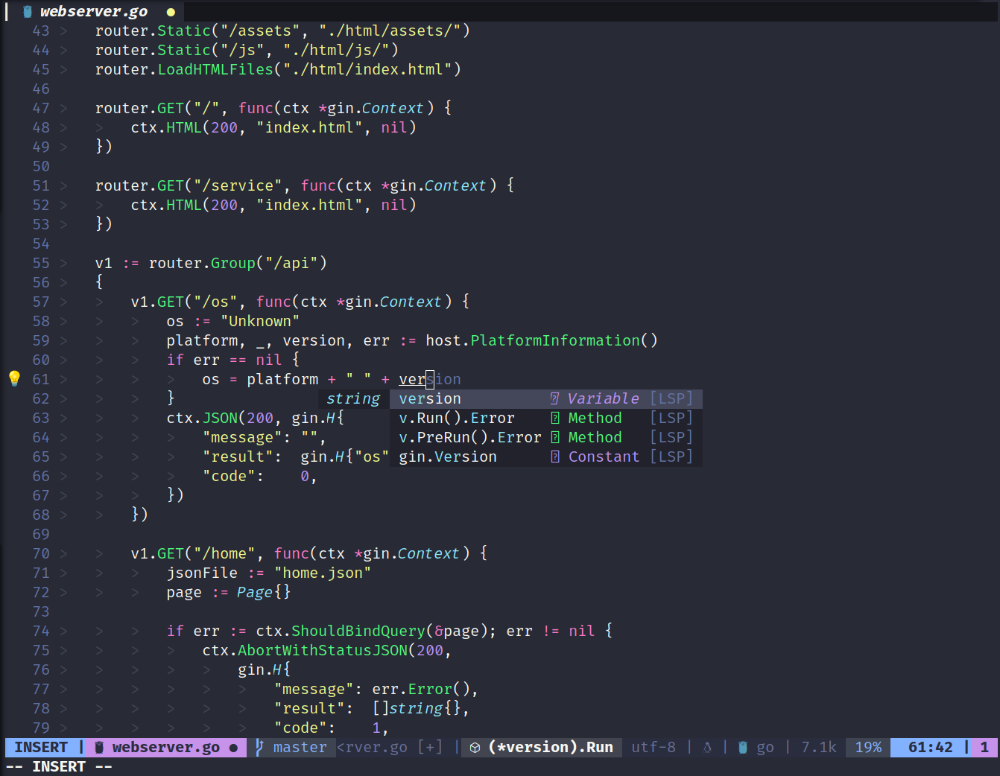
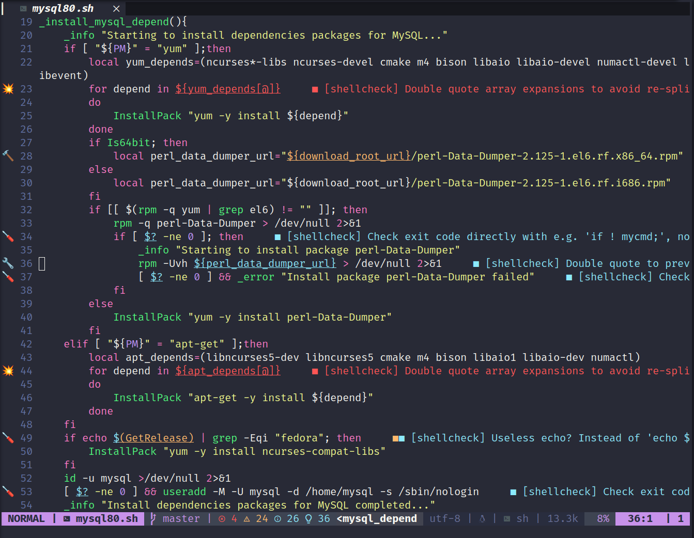
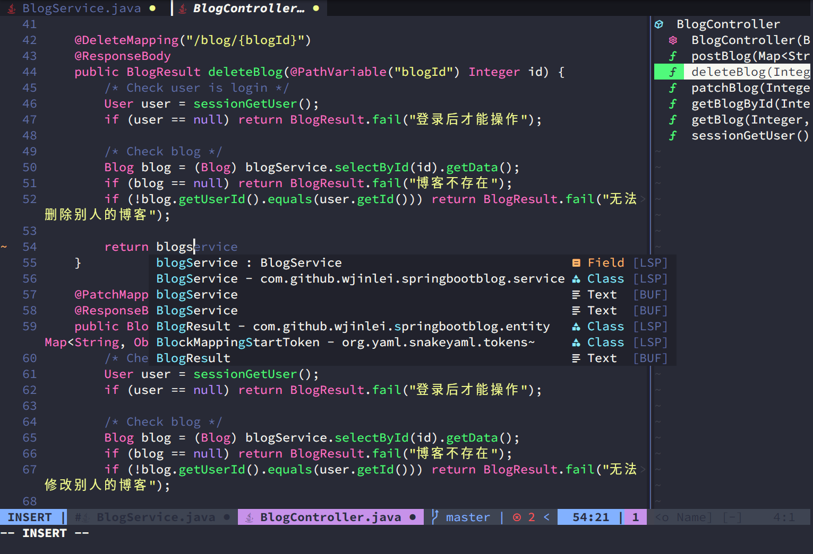
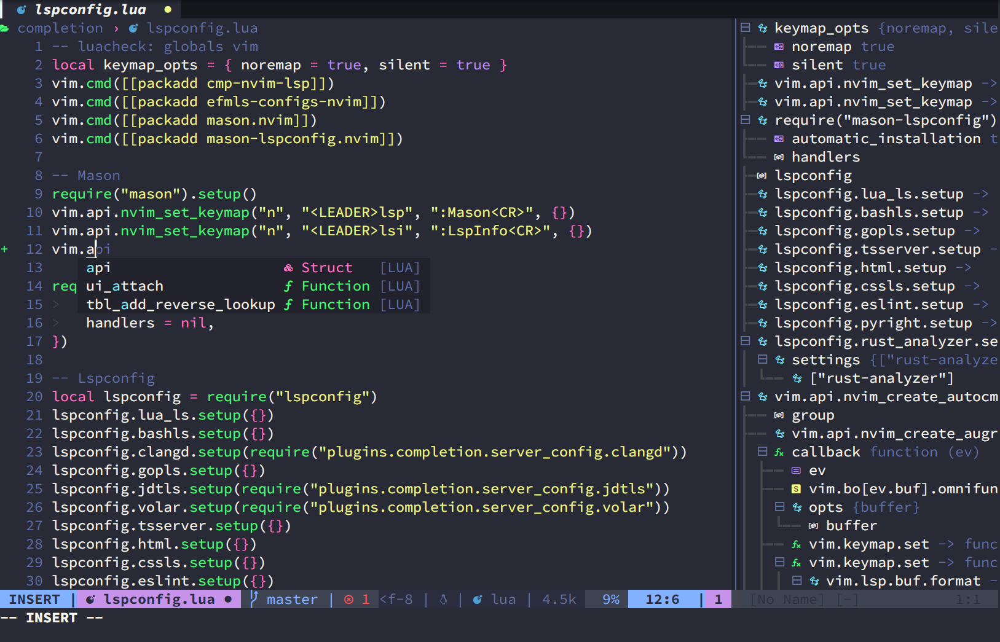

## Features
- Beautiful UI
- Better replace
- Better search
- Better comment
- Better format
- LSP (Language server)
  - html/js/css
  - vue
  - c/c++
  - python
  - rust
  - go
  - java
  - lua
  - shell
  - php
- Code format
- Code snappet
- Code Outline
- File browser
- Markdown preview
- Git integration
- Tmux integration
- Toogle terminal
- ...

## Requirements
- Neovim >= 0.9.0
- [sqlite](https://www.sqlite.org/download.html)
- cmake
- file
- sed
- [ripgrep](https://github.com/BurntSushi/ripgrep)
- [fzf](https://github.com/junegunn/fzf)
- [tree-sitter](https://github.com/tree-sitter/tree-sitter)
- xclip(optional)
### For windows
- sqlite
```lua
vim.g.sqlite_clib_path = "path/to/sqlite3.dll"
```

## Install
```sh
git clone https://github.com/Wjinlei/nvim.git ~/.config/nvim
```
### After Installation, You Need To
  - Python3 install `pynvim`
```
Set your python3 path in `lua/core/python3_host_prog.lua`
```
  - Nodejs install `neovim`
  - Install [Nerd font](https://www.nerdfonts.com/)
  - Do `:checkhealth`

## Keymap
### File browser
  - Open file browser `tt`
### Markdown preview
  - Open preview in default browser `<C-c>m` 
### Better comment
  - Comment current `gcc`
  - Comment select area `gc`
### Better search
  - Search file `ff`
  - Search string `fs`
  - Search project file `fp`
  - Search git file `fg`
  - Search history file `fh`
  - Search buffer `bb`
  - Hop search `.` & `,`
### Better replace
  - Search and replace `fr`
  - Search and replace current word `fw`
### Git integration
  - Folding of unchanged text `gf`
  - Goto next hunk `gn`
  - Goto prev hunk `gp`
  - Git status `gs`
### LSP
> You must install a language server `<LEADER>lsp`
  - Code Outline `C-o`
  - Code Rename `<LEADER>rn`
  - Code Format `<LEADER>f`
  - Show bufr diagnostic `<A-d>`
  - Goto prev diagnostic `<A-i>`
  - Goto next diagnostic `<A-n>`
  - Code action `<C-a>`
  - Goto declaration `gD`
  - Goto definition `gd`
  - Goto implementation `gi`
  - Goto references `gr`
  - Goto type_definition `gt`
  - Goto hover `gh`
  - Goto signature_help `gH`
### Other
  - Toggle terminal `C-\`
  - Startup time `<C-c>s`
  - Sudo write `<LEADER>w`
  - Sudo read `<LEADER>r`
  - PackerInstall `<C-x>i`
  - PackerSync `<C-x>u`
  - PackerCompile `<C-x>x`

### Tmux integration 
Must be in `.tmux.conf `Add the following configuration to conf

<details>
  <summary>Click to expand</summary>

```sh
is_vim="ps -o state= -o comm= -t '#{pane_tty}' | grep -iqE '^[^TXZ ]+ +(\\S+\\/)?g?(view|n?vim?x?)(diff)?$'"

bind-key -n 'M-h' if-shell "$is_vim" 'send-keys M-h' { if -F '#{pane_at_left}' '' 'select-pane -L' }
bind-key -n 'M-j' if-shell "$is_vim" 'send-keys M-j' { if -F '#{pane_at_bottom}' '' 'select-pane -D' }
bind-key -n 'M-k' if-shell "$is_vim" 'send-keys M-k' { if -F '#{pane_at_top}' '' 'select-pane -U' }
bind-key -n 'M-l' if-shell "$is_vim" 'send-keys M-l' { if -F '#{pane_at_right}' '' 'select-pane -R' }

bind-key -T copy-mode-vi 'M-h' if -F '#{pane_at_left}' '' 'select-pane -L'
bind-key -T copy-mode-vi 'M-j' if -F '#{pane_at_bottom}' '' 'select-pane -D'
bind-key -T copy-mode-vi 'M-k' if -F '#{pane_at_top}' '' 'select-pane -U'
bind-key -T copy-mode-vi 'M-l' if -F '#{pane_at_right}' '' 'select-pane -R'

bind -n 'Left' if-shell "$is_vim" 'send-keys Left' 'resize-pane -L 1'
bind -n 'Down' if-shell "$is_vim" 'send-keys Down' 'resize-pane -D 1'
bind -n 'Up' if-shell "$is_vim" 'send-keys Up' 'resize-pane -U 1'
bind -n 'Right' if-shell "$is_vim" 'send-keys Right' 'resize-pane -R 1'

bind-key -T copy-mode-vi Left resize-pane -L 1
bind-key -T copy-mode-vi Down resize-pane -D 1
bind-key -T copy-mode-vi Up resize-pane -U 1
bind-key -T copy-mode-vi Right resize-pane -R 1
```

</details>

## Preview
Vue

Rust

Go

Shell

Java

Lua


## FAQ
1. 安装插件失败?
```
请确认是否科学上网，注意使用全局代理，光浏览器代理是没用的。
```

2. 没有代码补全提示?
```
请确认是否安装对应语言的`lsp`服务器，使用`<LEADER>lsp`呼出面板安装即可。
```

3. 一些图标显示`?`号
```
nerd fonts 字体问题，nerd fonts 3.0版本以上，移动了一些符号，导致某些图标显示不正常
升级到 nerd fonts 3.0 版本以上即可，写本文时，我用的版本是`3.0.2`
```

4. 安装jdtls语言服务器后Java补全还是不生效?
- 你需要下载一个`jdk17或以上的版本`(jdtls需要jdk17以上)放入`一个你指定的目录`  
```
然后修改jdtls的配置文件`lua/plugins/completion/server_config/jdtls.lua`中的 
env.JAVA = "/usr/local/jdk-17.0.7/bin/java"路径为你的jdk路径即可  
```
- 如果你不是`Linux`系统，你还需修改`get_jdtls_config_dir()`函数的参数`config_linux`为你对应的系统

## Thanks to the authors of the following projects
- [ayamir](https://github.com/ayamir/nvimdots)
- [seagle0128](https://github.com/seagle0128/.emacs.d)
