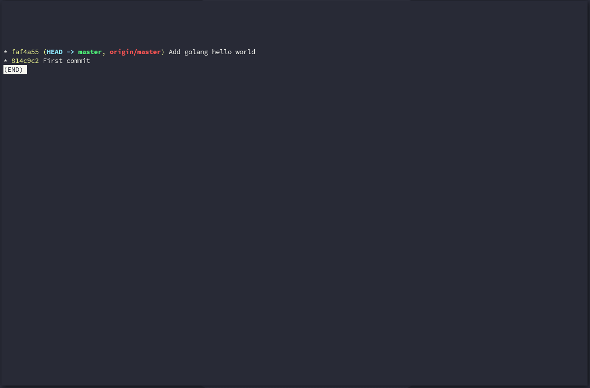
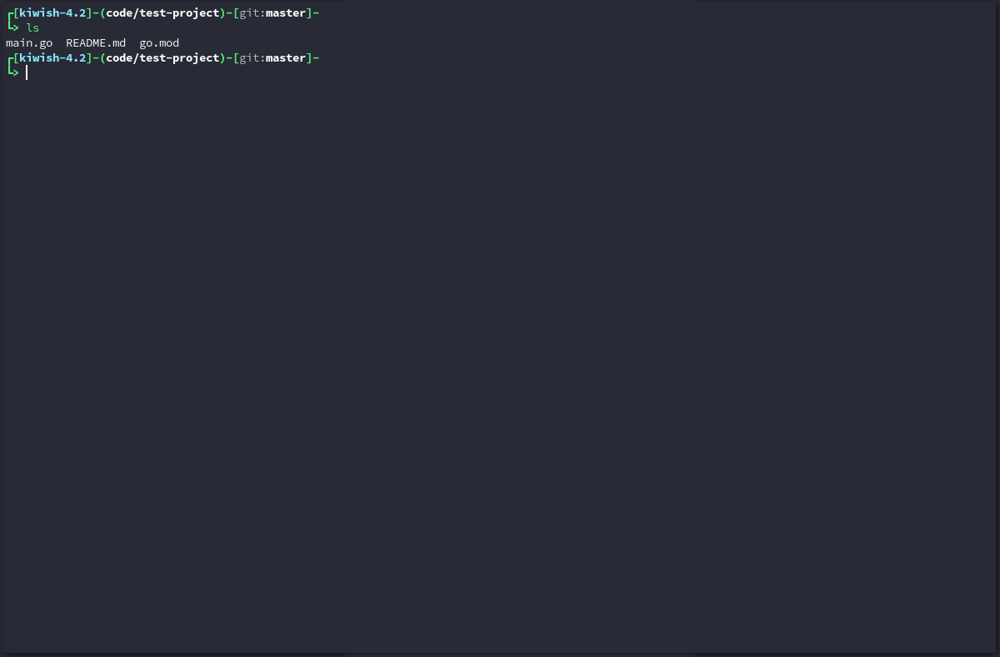
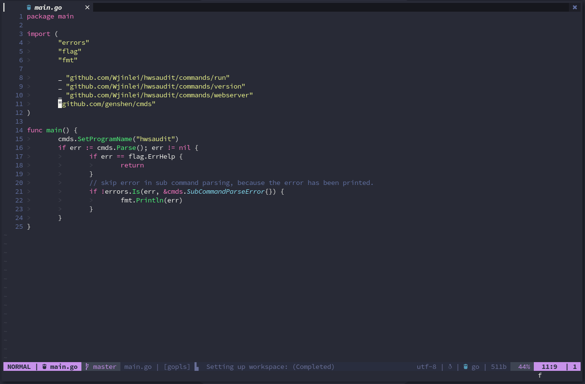
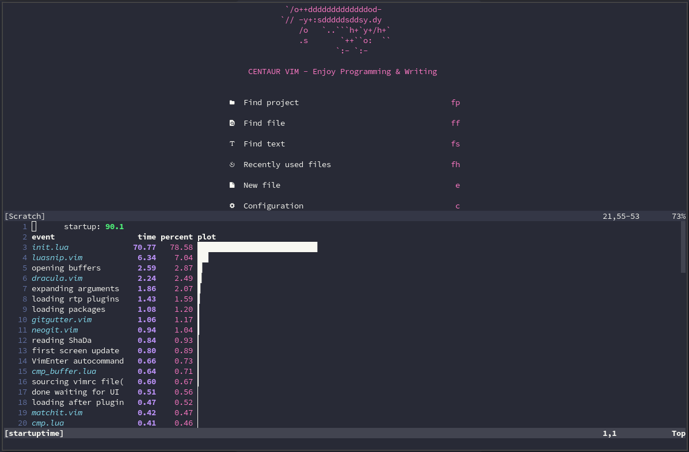

## Preview
- Project file search

- Git

- File browser

- LSP

- Start time


## Features

- Beautiful UI
- Better replace
- Better search
- Better comment
- Better format
- Git integration
- Tmux integration 
- File browser
- Markdown preview
- LSP (language server)
- Snappet
- Toogle terminal
- ...

## Requirements
- Neovim >= 0.5.0
- [ripgrep](https://github.com/BurntSushi/ripgrep)
- [fzf](https://github.com/junegunn/fzf)
- xclip(optional)

## Install
```sh
git clone https://github.com/Wjinlei/nvim.git ~/.config/nvim
```
### After Installation, You Need To
  - Python3 install `pynvim`
  - Nodejs install `neovim`
  - Install Nerd font
  - Do `:checkhealth`

## Keymap
### Better search
  - Search file `ff`
  - Search string `fs`
  - Search project file `fp`
  - Search git file `fg`
  - Search history file `fh`
  - Search buffer `bb`
### Better replace
  - Search and replace `fr`
  - Search and replace current word `fw`
### Git integration
  - Folding of unchanged text `gf`
  - Goto next hunk `gn`
  - Goto prev hunk `gp`
  - Git status `gs`

### Tmux integration 
Must be in `.tmux.conf `Add the following configuration to conf

<details>
  <summary>Click to expand</summary>

```sh
is_vim="ps -o state= -o comm= -t '#{pane_tty}' | grep -iqE '^[^TXZ ]+ +(\\S+\\/)?g?(view|n?vim?x?)(diff)?$'"

bind-key -n 'M-h' if-shell "$is_vim" 'send-keys M-h' { if -F '#{pane_at_left}' '' 'select-pane -L' }
bind-key -n 'M-j' if-shell "$is_vim" 'send-keys M-j' { if -F '#{pane_at_bottom}' '' 'select-pane -D' }
bind-key -n 'M-k' if-shell "$is_vim" 'send-keys M-k' { if -F '#{pane_at_top}' '' 'select-pane -U' }
bind-key -n 'M-l' if-shell "$is_vim" 'send-keys M-l' { if -F '#{pane_at_right}' '' 'select-pane -R' }

bind-key -T copy-mode-vi 'M-h' if -F '#{pane_at_left}' '' 'select-pane -L'
bind-key -T copy-mode-vi 'M-j' if -F '#{pane_at_bottom}' '' 'select-pane -D'
bind-key -T copy-mode-vi 'M-k' if -F '#{pane_at_top}' '' 'select-pane -U'
bind-key -T copy-mode-vi 'M-l' if -F '#{pane_at_right}' '' 'select-pane -R'

bind -n 'Left' if-shell "$is_vim" 'send-keys Left' 'resize-pane -L 1'
bind -n 'Down' if-shell "$is_vim" 'send-keys Down' 'resize-pane -D 1'
bind -n 'Up' if-shell "$is_vim" 'send-keys Up' 'resize-pane -U 1'
bind -n 'Right' if-shell "$is_vim" 'send-keys Right' 'resize-pane -R 1'

bind-key -T copy-mode-vi Left resize-pane -L 1
bind-key -T copy-mode-vi Down resize-pane -D 1
bind-key -T copy-mode-vi Up resize-pane -U 1
bind-key -T copy-mode-vi Right resize-pane -R 1
```

</details>

### File browser
  - Open file browser `tt`
### Markdown preview
  - Open preview in default browser `<C-c>m` 
### Better comment
  - Comment current `gcc`
  - Comment select area `gc`
### LSP
> You must install a language server `<LEADER>lsp`
  - Smart rename `rn`
  - Code action `<C-a>`
  - Format `<LEADER>f`
  - Goto definition `gd`
  - Goto declaration `gt`
  - Goto implementation `gi`
  - Goto refrences `gf`
  - Goto prev diagnostic `<A-i>`
  - Goto next diagnostic `<A-n>`
### Explore more features

## Thanks to the authors of the following projects
- [ayamir](https://github.com/ayamir/nvimdots)
- [ravenxrz](https://github.com/ravenxrz/dotfiles/tree/master/nvim)
- [seagle0128](https://github.com/seagle0128/.emacs.d)
